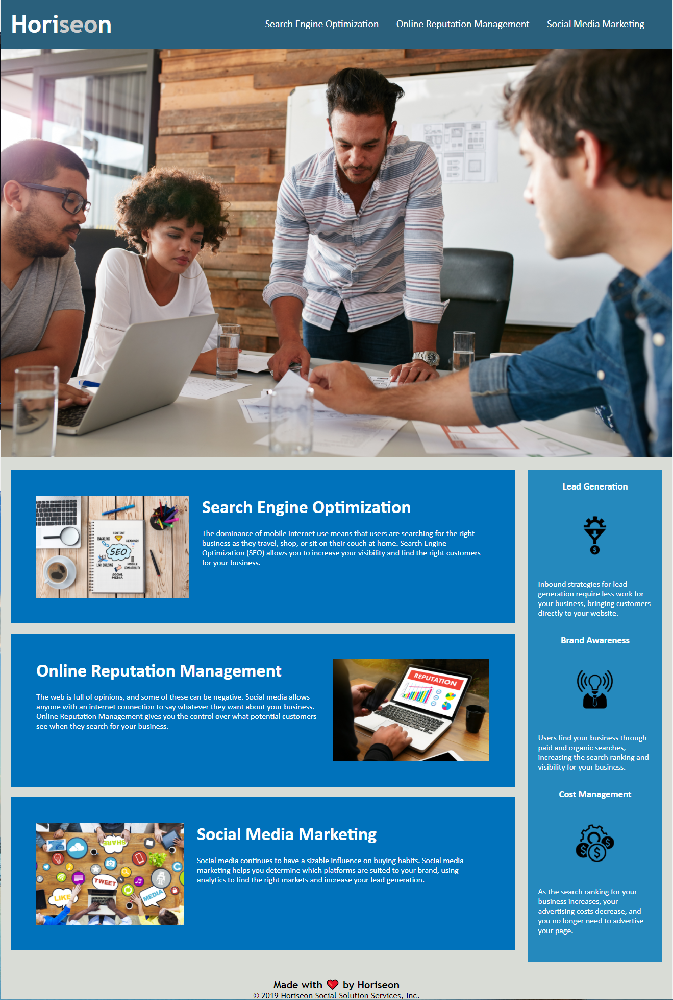

# Code-Refactor

## Description

Horiseon is a consulting firm helping businesses hone in on their internet presence.  They offer a host of services including Search Engine Optimization (SEO), online reputation management, and social media marketing.  They are looking for a developer who can refactor their existing code so it meets accessibility standards.

### Developer 

I have received Horiseon's website and source code information.  It is my duty to refactor their code to make sure it meets accessibility standards so that their own website is optimized for search engines.  I used semantic HTML elements with logical stucturing, independent of styling and positioning.  I added accessible alt attributes to all image elements.  One problem I ran into was appropriately commenting on my CSS code.  I wasn't sure how much was necessary or how in depth I should go.  I also didn't make any comments in my HTML file, which I am not sure if that is correct or not.  I did quite a lot about accessibility standards and semantic HTML and why it is important to use proper semantic HTML tags within the source code.

### Fucntionality

